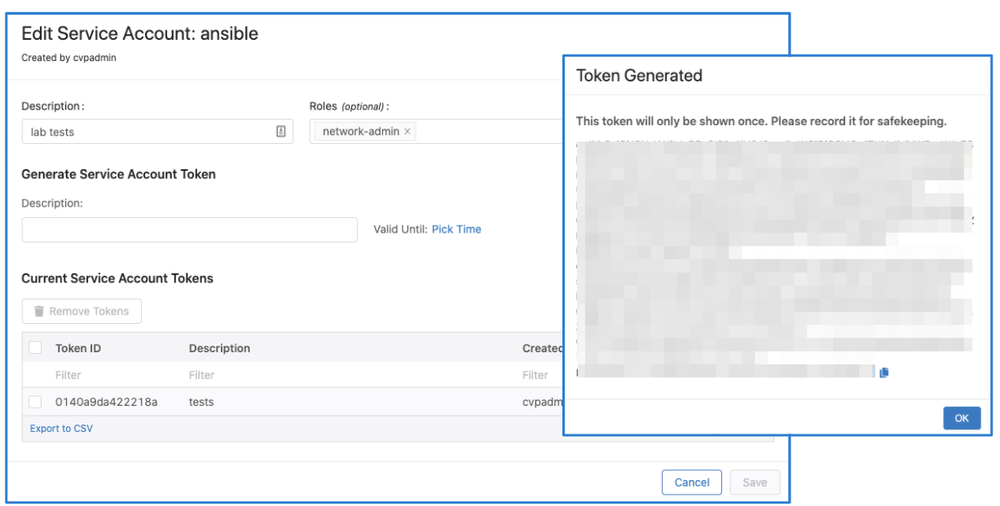
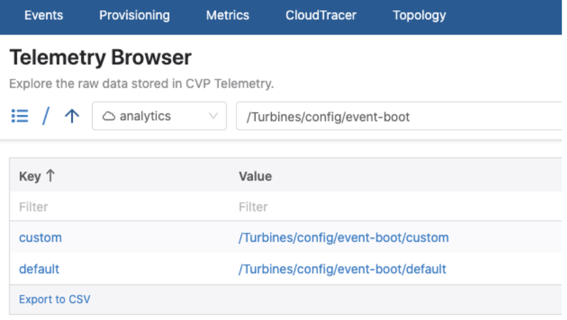
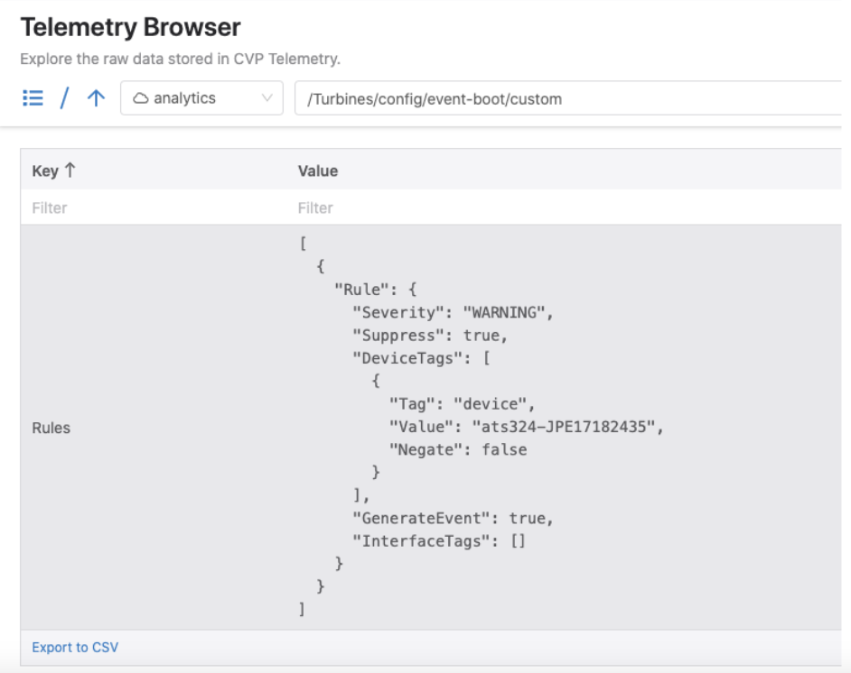
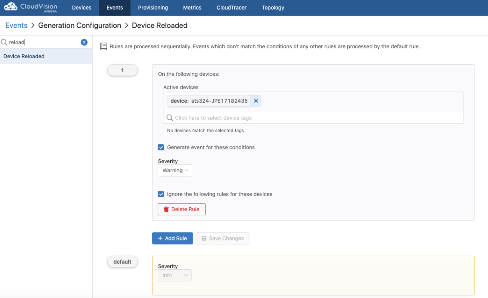

# CloudVision Connector Examples

## gRPC ports

- 8443 up to 2021.2.2
- 443 from 2021.3.0 or newer

## Authenticating with CloudVision

### CloudVision On-Prem

The [get_token.py](../get_token.py) script can be used to get the token (expires in 24h) and the certificate from
the CloudVision server:

`python3 get_token.py --server 10.83.12.79 --username cvpadmin --password arastra --ssl`

The two files that will be saved can then be used to authenticate:

- token.txt
- cvp.crt

> Note Starting from 2020.3.0 Service Account Token can be used just as on CloudVision as a Service.

### CloudVision as a Service

To access the CloudVision as-a-Service and send API requests, “Service Account Token” is needed.
After obtaining the service account token, it can be used for authentication when sending API requests.

Service accounts can be created from the Settings page where a service token can be generated as seen below:




The token should be copied and saved to a file that can later be referred to.

## get_lldp_nei.py

This script is an example on how to get the LLDP neighbors of a device (based on serialNumber).

```python
python3 get_lldp_nei.py --apiserver 192.0.2.79:443 --auth=token,token.tok,cvp.crt --device 8520AF39790A4EC959550166DC5DEADE
Port                          Neighbor Device ID            Neighbor Port ID              TTL
Ethernet2                      tp-avd-spine2                  Ethernet3                      120
Ethernet1                      tp-avd-spine1.tst              Ethernet3                      120
Ethernet3                      tp-avd-leaf4                   Ethernet3                      120
Ethernet4                      tp-avd-host2                   Ethernet1                      120
Ethernet5                      tp-avd-leaf4                   Ethernet5                      120
```

## get_intf_rate.py

---

This script is an example on how to subscribe to the rate counters of an interface.

```shell
python3 get_intf_rate.py --apiserver 192.0.2.79.79:443 --auth=token,token.txt,cvp.crt --
device JPE17182435 --interface Ethernet24
{
    "outOctets":99945180.4
}
{
    "outOctets":99660196.3
}
{
    "outOctets":99252974.8
}
{
    "outOctets":99084092.4
}
{
    "outOctets":100230212.3
}
```

In this example the subscription is made to the `outOctets` rate, other possible options are:

- alignmentErrors
- fcsErrors
- frameTooLongs
- frameTooShorts
- inBroadcastPkts
- inDiscards
- inErrors
- inMulticastPkts
- inOctets
- inUcastPkts
- outBroadcastPkts
- outDiscards
- outErrors
- outMulticastPkts

## get_intf_maxrate_period.py

---

This script is an example on how to get the maximum Tx and Rx utilization of an interface between a specified time period. It gets the max of `outOctets` and `inOctets` of 15 minute aggregated counters of the interface and publishes the maximum values of these 15 minute periods(max of max).

```shell
python3 get_intf_maxrate_period.py --apiserver 10.1.1.1:443 --auth=token,token.txt,cvp.crt --device SGD20000000 --interface Port-Channel27 --start=2021-06-03T05:30:00 --end=2021-06-03T08:20:00
Max Tx (Mbps) is:  597.531184
Max Rx (Mbps) is:  22.940072
```

## get_intf_status.py

---

The `get_intf_status.py` is an example on how to get the status of all the interfaces of a device. The below example get the link status, however other states can be read from the same path such as `operStatus`, `autonegCapabilities`, `burnedInAddr` (the mac address of the interface), `mtu` and many others. For more details visit the Telemetry Browser in the CloudVision UI.
It also creates a report about how many interfaces are up and down (including the Management interface).

```shell
python3 get_intf_status.py --apiserver 10.83.12.79:443 --auth=token,~/go79/token.txt,~/go79/cvp.crt --deviceId JPE17182435
Interface Name           Status

Ethernet10               linkDown
Ethernet1                linkDown
Ethernet2                linkDown
Ethernet3                linkDown
Ethernet8                linkDown
Ethernet5                linkDown
Ethernet9                linkDown
Ethernet24               linkUp
Ethernet26               linkUp
Management1              linkUp
<ommitted>

Ethernet Status on JPE17182435:
         8 interfaces connected (including Management)
        56 interfaces down
```

## get_switches.py

---

`get_switches.py` is an example on how to return all the actively streaming devices to CloudVision.

```shell
python3 get_switches.py --apiserver 10.83.12.79:443 --auth=token,token.txt,cvp.crt
{
    "ZZZ9999999":{
        "capabilities":[
            "all"
        ],
        "eosVersion":"4.24.4M",
        "hostname":"leaf1",
        "isProvisioned":false,
        "mac":"de:ad:be:ef:ca:fe",
        "modelName":"DCS-7050TX-64",
        "primaryManagementIP":"172.28.160.226",
        "status":"active",
        "terminAttrVersion":"v1.10.0"
    }
}
{
    "ZZZ9999998":{
        "capabilities":[
            "all"
        ],
        "eosVersion":"4.24.3M",
        "hostname":"spine1",
        "isProvisioned":true,
        "mac":"de:ad:b3:3f:ca:f3",
        "modelName":"DCS-7280SR-48C6",
        "primaryManagementIP":"172.28.161.108",
        "status":"active",
        "terminAttrVersion":"v1.10.0"
    }
}
```

## sync_events_cfg.py

---

The purpose of writing this script is to synchronize event generation rule configurations between two different CVP cluster.

This was tested on 2020.2.0 - 2020.3.0. It is recommended to run this script between clusters that are on the same version.

Script files used:

- sync_events_cfg.py
- dst_parser.py
- get_token.py

### Steps

1\. Clone the repository
`git clone https://github.com/aristanetworks/cloudvision-python.git`

2\. Go to example directory
`cd examples`

3\. Create a folder for each server to store the token and ssl cert files

```shell
mkdir go79
mkdir go173
```

4\. Copy the get_token.py to these folders

```shell
cp get_token.py go79/
cp get_token.py go173/
```

5\. Generate the token and cert for each server

```shell
cd go79
python3 get_token.py --server 10.83.12.79 --username cvpadmin --password arastra --ssl

cd ../go173
python3 get_token.py --server 10.83.12.173 --username cvpadmin --password arastra --ssl
```

6\. After that you should have 3 files in each folder like below

```shell
 cvp.crt
 get_token.py
 token.txt
```

7\. Now you can run the script

```shell
cd ../Connector

python3 sync_events_cfg.py --src=10.83.12.79:443 --srcauth=token,../go79/token.txt,../go79/cvp.crt --dst=10.83.12.173:443 --dstauth=token,../go173/token.txt,../go173/cvp.crt
```

8\. After this you should see the rules from server1 replicated to server2.

### What does the script do?

Gets all the data under ‘/Turbine/configs’ in the ‘analytics’ dataset where the the turbine configurations are stored
creates a list with all the turbine names that generate events
based on that list gets the configuration of each event turbine and saves that data in a dictionary
for each event there will be a ‘default’ key and in case a custom rule was applied it will also have a ‘custom’ key, each key will have an ‘updates’ key and a ‘path_elements’ key, e.g.:

```javascript
     eventName: { “default”: {“updates”: {<RULE data>},
                              “path_elements”:[<aeris path in list format>]
                              },
                  “custom”: {“updates”: {<RULE data>},
                             “path_elements”:[<aeris path in list format>]
                                                 }}
```

the default configs are backed up and saved in a json file from both servers, the filenames are:

- backupsource-cvp.json
- backupdest-cvp.json

the config from the source server is pushed to the destination server





## get_events.py

---

This script is a very simplistic example of the resource API equivalent `get_events.py` and it prints all current active events in CloudVision.

```shell
python3 get_events.py  --apiserver 10.83.12.79:443 --auth=token,~/go79/token.txt,~/go79/cvp.crt
{
    "74694dfb259599":{
        "ack":true,
        "acknowledgement":{
            "timestamp":"1604061595270",
            "userId":"cvpadmin"
        },
        "components":[
            {
                "deviceId":"JPE17182435",
                "type":"device"
            }
        ],
        "data":{
            "checkItems":{
                "Flood List":{
                    "desc":"No flood list configured",
                    "name":"Flood List",
                    "result":"Fail"
                },
                "Loopback IP Address":{
                    "desc":"",
                    "name":"Loopback IP Address",
                    "result":"Pass"
                },
                "Routing":{
                    "desc":"",
                    "name":"Routing",
                    "result":"Pass"
                },
                "VLAN-VNI Map":{
                    "desc":"",
                    "name":"VLAN-VNI Map",
                    "result":"Pass"
                }
            },
            "deviceId":"JPE17182435"
        },
        "delTime":0,
        "description":"Local VTEP configuration check failed",
        "eventType":"VXLAN_CONFIG_SANITY",
        "isInteractionUpdate":true,
        "key":"74694dfb259599",
        "keySchema":[
            "deviceId"
        ],
        "lastUpdatedTime":1604061595270,
        "severity":"WARNING",
        "timestamp":1597406296448,
        "title":"Vxlan Config Sanity Check failed"
    }
}
```

Get events within a certain period of time:

`python3 get_events.py  --apiserver 10.83.12.79:443 --auth=token,token.txt,cvp.crt --start=2021-02-02T10:00:00 --end=2021-02-02T21:46:00 --exact_range=True`

> Note that without setting the `-exact_range` flag to `True` events before the start time that were active at start time will also
> be presented.

## bugalerts_report.py

---

This script is an example on how to generate a report about number of bugs per device, CVEs per device and Bugs per device.

```shell
python3 bugalerts.py --apiserver 10.83.12.79:443 --auth=token,token.txt,cvp.crt

Report #1 - BugCount

Device SN                                         Number of bugs
0123F2E4462997EB155B7C50EC148767                  8
2568DB4A33177968A78C4FD5A8232159                  2
6323DA7D2B542B5D09630F87351BEA41                  3
8520AF39790A4EC959550166DC5DEADE                  3
CD0EADBEEA126915EA78E0FB4DC776CA                  3

Report #2 - CVEs

Device Hostname               EOS Version                   CVEs
tp-avd-leaf2                  4.23.3M                       CVE-2018-0732,CVE-2020-10188
tp-avd-spine2                 4.25.3.1M
tp-avd-leaf4                  4.25.3.1M
tp-avd-leaf3                  4.25.3.1M
tp-avd-spine1                 4.25.3.1M

Report #3 - Bugs

tp-avd-leaf2                  4.23.3M                       281795,444677,464188,472113,489787,496371,523122,556742
tp-avd-spine2                 4.25.3.1M                     556742,573022
tp-avd-leaf4                  4.25.3.1M                     556742,573022,583243
tp-avd-leaf3                  4.25.3.1M                     556742,573022,583243
tp-avd-spine1                 4.25.3.1M                     556742,573022,578276

Report #4 - Lifecycle statements - End of Life

Hostname                                Serial number                           Model                                   End of Life                             
leaf1                                   ZZZ99999999                             7328X-FM(4)                             2025-10-02                              
leaf2                                   ABC12345678                             7328X-FM(4)                             2025-10-02                              
spine1                                  EFG09876543                             DCS-7050QX-32(1)                        2020-03-22 

Report #5 - Lifecycle statements - End of Sale

Hostname                                Serial number                           Model                                   End of Sale                             
leaf1                                   ZZZ99999999                             7328X-FM(4), 7320X-32C-LC(5)            2021-10-02                              
leaf2                                   ABC12345678                             7328X-FM(4), 7320X-32C-LC(8)            2021-10-02                              
spine1                                  EFG09876543                             DCS-7050QX-32(1)                        2017-03-23     

Report #6 - Lifecycle statements - End of TAC Suppor

Hostname                                Serial number                           Model                                   End of TAC Support                      
leaf1                                   ZZZ99999999                             7328X-FM(4)                             2025-10-02                              
leaf2                                   ABC12345678                             7328X-FM(4)                             2025-10-02                              
spine1                                  EFG09876543                             DCS-7050QX-32(1)                        2020-03-22                   

Report #7 - Lifecycle statements - End of Hardware RMA Requests

Hostname                                Serial number                           Model                                   End of Hardware RMA Requests            
leaf1                                   ZZZ99999999                             7328X-FM(4)                             2025-10-02                              
leaf2                                   ABC12345678                             7328X-FM(4)                             2025-10-02                              
spine1                                  EFG09876543                             DCS-7050QX-32(1)                        2020-03-22                  

Report #8 - End of Life (SW + HW)

Device                                  Type                                    Component                               End of Life                             
leaf1                                   software                                4.27.0F                                 2024-09-27                              
leaf2                                   software                                4.27.4M                                 2024-09-27                              
spine1                                  software                                4.25.2F                                 2023-10-22
leaf3                                   hardware                                7328X-FM(4)                             2025-10-02                              
leaf4                                   hardware                                DCS-7050QX-32(1)                        2020-03-22                              
spine2                                  hardware                                DCS-7050QX-32(1)                        2020-03-22              
```

## connectivityMonitorVrf.py

---

This script can get connectivity monitor data either for individual devices or for all devices that are streaming connectivity monitor statistics.

All device stats:

```shell
python3 connectivityMonitorVrf.py --apiserver 10.83.12.174:443 --auth=token,token.txt,cvp.crt
Connection                                        Host IP Address per VRF       HTTP RESPONSE TIME per VRF    Jitter per VRF                Latency per VRF               Packet Loss Per VRF
tp-avd-leaf3 (MGMT/default) to bbc                151.101.0.81                  0.0ms                         0.0ms                         0.0ms                         0%
tp-avd-leaf3 (MGMT/Management1) to bbc            151.101.0.81                  62.8902587890625ms            0.13899999856948853ms         5.572000026702881ms           0%
tp-avd-leaf3 (MGMT/default) to google             216.58.194.164                0.0ms                         0.0ms                         0.0ms                         0%
tp-avd-leaf3 (MGMT/Management1) to google         216.58.194.164                94.55423736572266ms           0.2549999952316284ms          155.31199645996094ms          0%
tp-avd-leaf1 (MGMT/Management1) to bbc            151.101.0.81                  112.4276351928711ms           1.3760000467300415ms          6.27400016784668ms            0%
tp-avd-leaf1 (MGMT/Management1) to google         216.58.194.164                528.8643798828125ms           0.37700000405311584ms         154.99899291992188ms          0%
```

Per device stats:

```shell
python3 connectivityMonitorVrf.py --apiserver 10.83.12.174:443 --auth=token,token.txt,cvp.crt --device BAD032986065E8DC14CBB6472EC314A6
Connection                                        Host IP Address per VRF       HTTP RESPONSE TIME per VRF    Jitter per VRF                Latency per VRF               Packet Loss Per VRF
tp-avd-leaf1 (MGMT/Management1) to bbc            151.101.0.81                  137.05465698242188ms          0.10700000077486038ms         5.6539998054504395ms          0%
tp-avd-leaf1 (MGMT/Management1) to google         216.58.194.164                588.5230102539062ms           0.09799999743700027ms         155.143005371093
```

## Utilities

---

- `pretty_print` from `utils.py` can be used to pretty print notifications that have frozen dictionaries
- `parser.py` and `dst_parser.py` contain the arugment parsers for connecting to CloudVision
- `delete.py` can delete keys from a specific path ( Not recommended to be used without contacting Arista Support )

## CloudVision as a Service example

The only difference between sending requests to CloudVision as a Service compared to CloudVision On-Prem is that only the service token is needed and the API endpoint is at TCP 443 instead of 8443.

```shell
python3 get_switches.py --apiserver apiserver.arista.io:443 --auth=token,cvaasToken.txt
{
    "0123F2E4462997EB155B7C50EC148767":{
        "capabilities":[
            "all"
        ],
        "deviceType":"",
        "eosVersion":"4.24.3M",
        "hostname":"tp-avd-leaf2",
        "isProvisioned":true,
        "mac":"50:08:00:b1:5b:0b",
        "modelName":"vEOS",
        "primaryManagementIP":"10.83.13.215",
        "status":"active",
        "terminAttrVersion":"v1.12.2"
    }
}
{
    "2568DB4A33177968A78C4FD5A8232159":{
        "capabilities":[
            "all"
        ],
        "deviceType":"",
        "eosVersion":"4.24.3M",
        "hostname":"tp-avd-spine2",
        "isProvisioned":true,
        "mac":"50:08:00:8c:22:49",
        "modelName":"vEOS",
        "primaryManagementIP":"10.83.13.213",
        "status":"active",
        "terminAttrVersion":"v1.12.2"
    }
}
```
