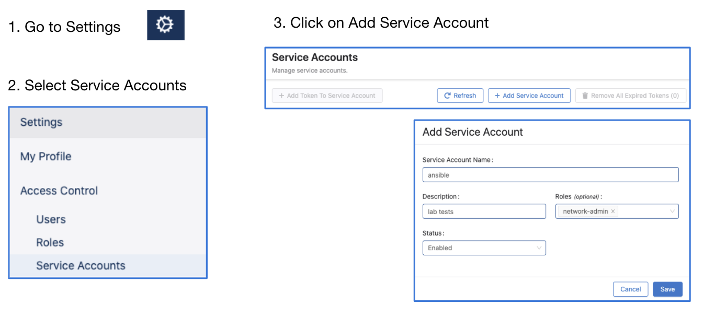
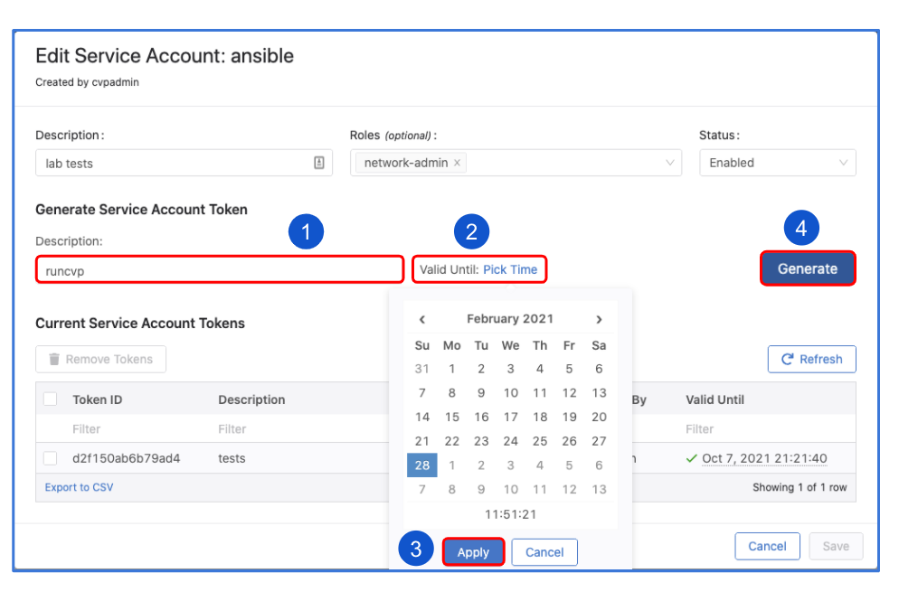
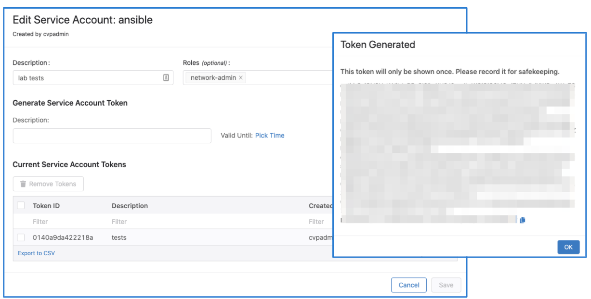

# Inventory resource examples

## Authenticating with CloudVision

To access the CloudVision and send API requests, “Service Account Token” is needed.
After obtaining the service account token, it can be used for authentication when sending API requests.

Service accounts can be created from the Settings page where a service token can be generated as seen below:





The token should be copied and saved to a file that can later be referred to.

## lookup_device.py


`lookup_device.py` can fetch information such as the serial number, hostname, software version, model name,
hardware revision, FQDN, domain name, system MAC address, boot time, streaming status and the status of extended
attributes (danz, mlag).

```
python3 lookup_device.py --help
usage: lookup_device.py [-h] --server SERVER --token-file TOKEN_FILE [--serial SERIAL]
                        [--hostname HOSTNAME]

Lookup a single device by serial, hostname, or require both.

optional arguments:
  -h, --help            show this help message and exit
  --server SERVER       CloudVision server to connect to in <host>:<port> format
  --token-file TOKEN_FILE
                        file with access token
  --serial SERIAL       serial number of device to lookup
  --hostname HOSTNAME   hostname of device to lookup
```

### Example

```
python3 lookup_device.py --server 10.83.12.79:443 --token-file ~/go79/token.txt --hostname leaf1
{
    "value": {
        "key": {
            "deviceId": "F4F1A7BDDDC7ED5901FE5021070A69E1"
        },
        "softwareVersion": "4.25.1F",
        "modelName": "DCS-7160-48YC6",
        "hardwareRevision": "11.01",
        "fqdn": "leaf1.aristanetworks.com",
        "hostname": "leaf1",
        "domainName": "aristanetworks.com",
        "systemMacAddress": "00:50:56:1f:17:a0",
        "streamingStatus": "ACTIVE",
        "extendedAttributes": {
            "featureEnabled": {
                "Danz": false,
                "Mlag": false
            }
        }
    },
    "time": "2025-11-03T16:58:53.549577786",
    "type": "INITIAL"
}
```

## get_versions.py

The `get_versions.py` script can get all devices and their EOS versions
or get the EOS version of a specific device.

```
python3 get_versions.py --help
usage: get_versions.py [-h] --server SERVER --token-file TOKEN_FILE [--serial SERIAL]
                       [--hostname HOSTNAME]

Lookup a single device by serial, hostname, or require both.

optional arguments:
  -h, --help            show this help message and exit
  --server SERVER       CloudVision server to connect to in <host>:<port> format
  --token-file TOKEN_FILE
                        file with access token
  --serial SERIAL       serial number of device to lookup
  --hostname HOSTNAME   hostname of device to lookup
```

### Example

Get all devices and their EOS versions:

```
python3 get_versions.py --server 10.83.12.79:443 --token-file token.txt
Hostname                 EOS Version

leaf1                    4.24.4M
leaf2                    4.24.3M
core1                   4.20.12.1M
core2                    4.20.12.1M
sw-10.83.12.244          4.22.1F
spine1                   4.25.0F
sw-10.83.12.245          4.22.1F
```

Get the EOS version of a specific device:

```
python3 get_versions.py --server 10.83.12.79:443 --token-file token.txt \
--serial ZZZ9999999 --hostname leaf1
Hostname                 EOS Version

leaf1                    4.24.4M
```

## example_utility.py

The example_utility.py allows reading all devices, only active devices, only inactive devices,
or looking up a single device by serial number(similarly to `lookup_device.py`).
The `--active` filter takes priority over `--inactive`, and the GetAll takes priority
over the single-device path.

```
python3 example_utility.py --help
usage: example_utility.py [-h] --server SERVER --token-file TOKEN_FILE [--device DEVICE]
                          [--active] [--inactive]

Get devices in inventory.

optional arguments:
  -h, --help            show this help message and exit
  --server SERVER       CloudVision server to connect to in <host>:<port> format
  --token-file TOKEN_FILE
                        file with access token

  --device DEVICE       get a single device by serial number
  --active              get only actively streaming devices
  --inactive            get only non-actively streaming devices
```

### Example

Get all actively streaming devices and their serial numbers:

```
python3 example_utility.py --server 10.83.12.79:443 --token-file ~/go79/token.txt --active
leaf1                    5298089ABC0DA0D24213681DDDB30CE6
leaf2                    6298089ABC0DA0D24213681DDDB30C26
core1                    7298089ABC0DA0D24213681DDDB30C46
core2                    9298089ABC0DA0D24213681DDDB30C36
sw-10.83.12.244          1298089ABC0DA0D24213681DDDB30CE6
sw-10.83.12.245          3359B0469FE6C1E92CBB93C5CA77E83C
spine1                   4881D89918374E56222F62553E89319B
7 matching devices in inventory
```
