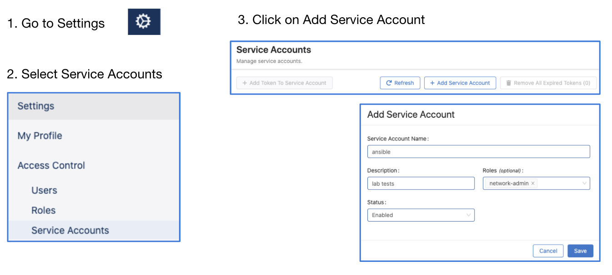

# Events resource examples

## gRPC ports

- 8443 up to 2021.2.2
- 443 from 2021.3.0 or newer

## Authenticating with CloudVision

### CloudVision On-Prem

The [get_token.py](../../get_token.py) script can be used to get the token and the certificate from
the CloudVision server:

`python3 get_token.py --server 10.83.12.79 --username cvpadmin --password arastra --ssl`

The two files that will be saved can then be used to authenticate:
- token.txt
- cvp.crt

### CloudVision as a Service

To access the CloudVision as-a-Service and send API requests, “Service Account Token” is needed.
After obtaining the service account token, it can be used for authentication when sending API requests.

Service accounts can be created from the Settings page where a service token can be generated as seen below:




The token should be copied and saved to a file that can later be referred to.
## get_events.py

The `get_events.py` script can both get and acknowledge events.

### Examples

1) Get all events:

```
python3 get_events.py --server 10.83.12.79:443 --token-file token.txt --cert-file cvp.crt
```

2) Get all events after date:

```
python3 get_events.py --server 10.83.12.79:443 --token-file token.txt --cert-file cvp.crt --start 2021-02-02T00:00:01.000000001Z
```

3) Get all `Interface went down unexpectedly` events between two dates:

```
python3 get_events.py --server 10.83.12.79:443 --token-file token.txt --cert-file cvp.crt --event-type DEVICE_INTF_ERR_SMART --start 2021-01-31T00:00:01.000000001Z --end 2021-01-31T22:00:01.000000001Z
value {
  key {
    key {
      value: "2dd62e6ac29f6cf"
    }
    timestamp {
      seconds: 1612068655
      nanos: 325112134
    }
  }
  severity: EVENT_SEVERITY_WARNING
  title {
    value: "Interface went down unexpectedly"
  }
  description {
    value: "Interface Ethernet24/3 on ZZZ9999999 is no longer operationally active"
  }
  event_type {
    value: "DEVICE_INTF_ERR_SMART"
  }
  data {
    data {
      key: "deviceId"
      value: "JPE16102384"
    }
    data {
      key: "interfaceId"
      value: "Ethernet24/3"
    }
  }
  components {
    components {
      type: COMPONENT_TYPE_INTERFACE
      components {
        key: "deviceId"
        value: "JPE16102384"
      }
      components {
        key: "interfaceId"
        value: "Ethernet24/3"
      }
    }
  }
}
time {
  seconds: 1612068655
  nanos: 325112134
}
type: INITIAL
```

4) Get all INSUFFICIENT_PEER_LAG_REDUNDANCY events between two dates and acknowledge them:

```
python3 get_events.py --server 10.83.12.79:443 --token-file token.txt --cert-file cvp.crt --event-type INSUFFICIENT_PEER_LAG_REDUNDANCY --start 2021-01-31T00:00:01.000000001Z --end 2021-02-02T22:00:01.000000001Z --ack
```

5) Get all events with INFO severity:

```
python3 get_events.py --server 10.83.12.79:443- -token-file token.txt --cert-file cvp.crt --severity INFO
```

## sub_events.py

The `sub_events.py` can subscribe to CVP events.

### Examples

1) Subscribe to all events:

```
python3 sub_events.py --server 10.83.12.79:443 --token-file token.txt--cert-file cvp.crt
```

2) Subscribe to only specific event types, e.g. to subscribe to "Interface went down unexpectedly" events we can set the `event-type` to `DEVICE_INTF_ERR_SMART`:

```
python3 sub_events.py --server 10.83.12.79:443 --token-file token.txt--cert-file cvp.crt --event-type DEVICE_INTF_ERR_SMART
```

3) Subscribe to events with `INFO` severity:
```
python3 sub_events.py --server 10.83.12.79:443 --token-file token.txt--cert-file cvp.crt --severity INFO
```

## CloudVision as a Service example

The only difference between sending requests to CloudVision as a Service compared to CloudVision On-Prem is that only the service token is needed and the API endpoint is at TCP 443 instead of 8443.

For example to get the current "High CPU Load Average" events we can use the `get_events.py` script:

```
python3 get_events.py --server www.arista.io:443 --token-file cvaasToken.txt --event-type HIGH_CPU_LOAD_AVG
selecting events that match the filter partial_eq_filter {
  event_type {
    value: "HIGH_CPU_LOAD_AVG"
  }
}

value {
  key {
    key {
      value: "5b3e4aaaea6dfc33"
    }
    timestamp {
      seconds: 1612393259
      nanos: 485938570
    }
  }
  severity: EVENT_SEVERITY_WARNING
  title {
    value: "High CPU load average"
  }
  description {
    value: "Device\'s 15 minute CPU load average exceeded threshold of 2"
  }
  event_type {
    value: "HIGH_CPU_LOAD_AVG"
  }
  data {
    data {
      key: "deviceId"
      value: "7CA9C0014DBB4965F0748040DDB90A5C"
    }
    data {
      key: "threshold"
      value: "2"
    }
    data {
      key: "value"
      value: "2.594238"
    }
  }
  components {
    components {
      type: COMPONENT_TYPE_DEVICE
      components {
        key: "deviceId"
        value: "7CA9C0014DBB4965F0748040DDB90A5C"
      }
    }
  }
}
time {
  seconds: 1612393259
  nanos: 485938570
}
type: INITIAL
```