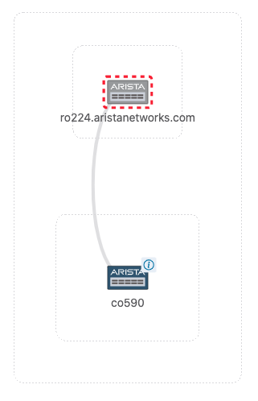
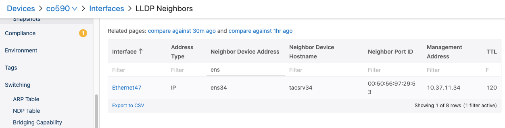
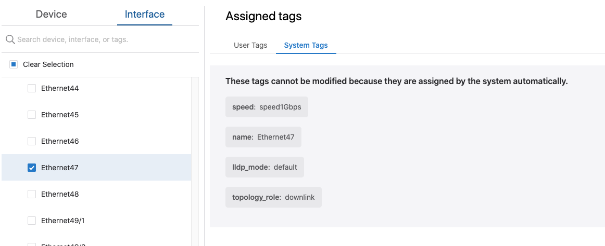
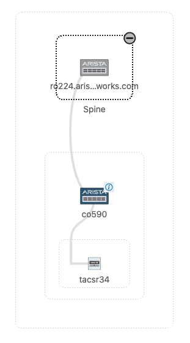
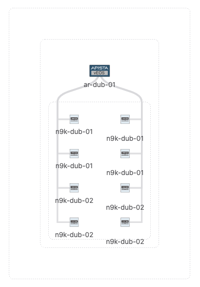
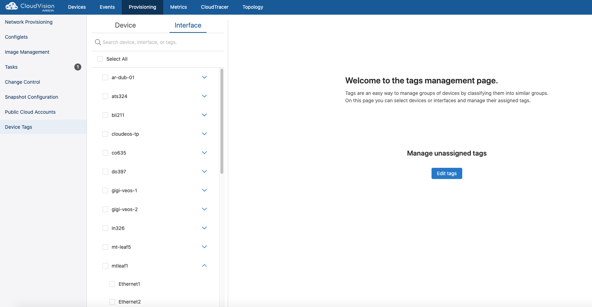
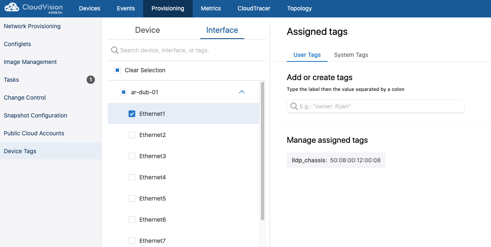
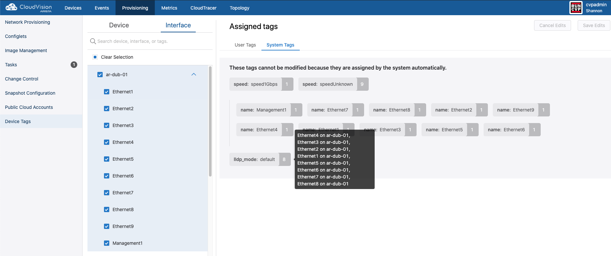
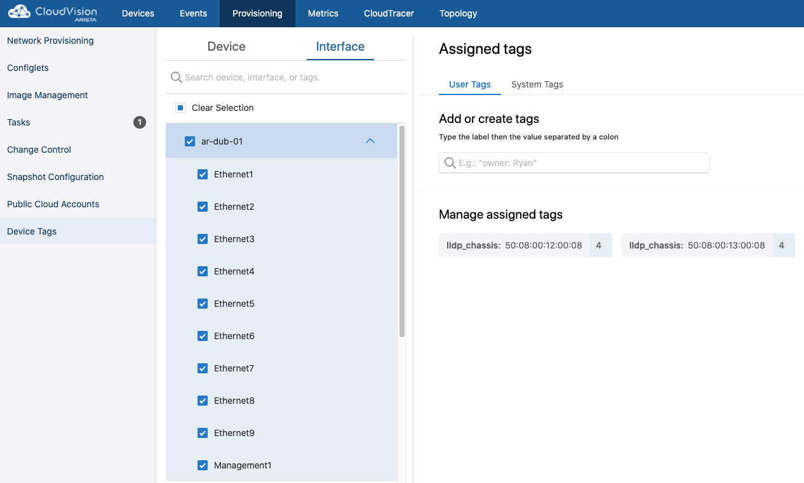
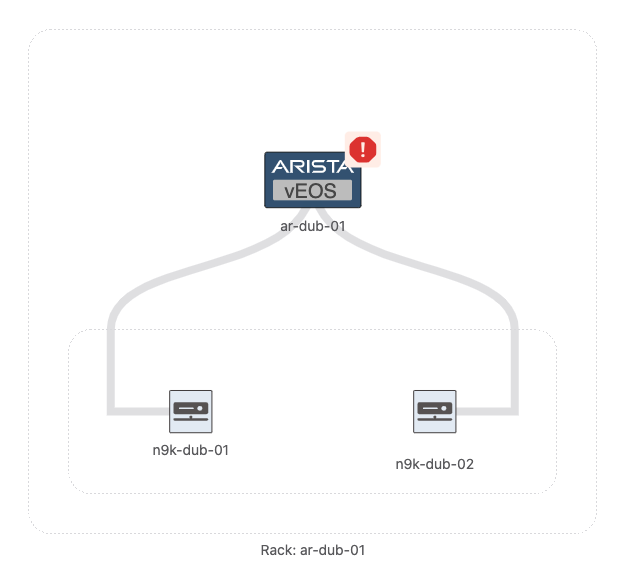

# Uses Cases

## Example 1) Making servers visible on Topology

As of 2020.2.0 the only supported LLDP Chassis ID TLV is subtype 4 (MAC Address). Due to this some 3rd party devices, like ESXI servers, which might advertise UUID or ifName instead of the Chassis MAC in the TLV, those devices will not be drawn on Topology, even though their LLDP states are seen in EOS. To workaround this we can tag the interfaces on the switches where these servers are connected with `lldp_chassis`, `lldp_mode` and `lldp_hostname` tags, thus forcing the values for those states.

Consider the following setup: **tacsrv34 (ens34) -- (et47) co590 --  ro224**

`co590` is receiving below LLDP information from tacsrv34:

```
co590...23:26:30(config)#show lldp nei et47 det
Interface Ethernet47 detected 1 LLDP neighbors:

  Neighbor "ens34"/0050.5697.2953, age 29 seconds
  Discovered 0:45:05 ago; Last changed 0:45:05 ago
  - Chassis ID type: Interface name (6)
    Chassis ID     : "ens34"
  - Port ID type: MAC address(3)
    Port ID     : 0050.5697.2953
  - Time To Live: 120 seconds
  - Port Description: "Interface   3 as ens34"
  - System Name: "tacsrv34"
  - System Description: "Linux tacsrv34 3.19.8-100.fc20.x86_64 #1 SMP Tue May 12 17:08:50 UTC 2015 x86_64"
  - System Capabilities : Station Only
    Enabled Capabilities: Station Only
  - Management Address Subtype: IPv4
    Management Address        : 10.37.11.34
    Interface Number Subtype  : ifIndex (2)
    Interface Number          : 3
    OID String                :
```

As you can see the `Chassis ID TLV` has subtype 6, which is `Interface name` and has the value of `ens34` (the interface name of the linux server).

If you check topology you'll see something like below (notice that the server is not shown):



On the Device page you'll see the server showing up in the LLDP table



### Steps

1\. Create the tags

Create the `lldp_chassis` tag and assign the MAC address of the server as the value:
`python3 create_tag.py --server 10.83.12.79:8443 --token-file token.txt --cert-file cvp.crt --tag_name "lldp_chassis" --tag_value "00:50:56:97:29:53"`

If it doesn't exist already, create the `lldp_mode: default` tag as well:
`python3 create_tag.py --server 10.83.12.79:8443 --token-file token.txt --cert-file cvp.crt --tag_name "lldp_mode" --tag_value "default"`

(Optional) Create the `lldp_hostname` tag:

`python3 create_tag.py --server 10.83.12.79:8443 --token-file token.txt --cert-file cvp.crt --tag_name "lldp_hostname" --tag_value "tacsr34"`

2\. Assign the tags to the interface:
`python3 itag.py --server 10.83.12.79:8443 --token-file token.txt --cert-file cvp.crt --device_id JPE14252458 --interface_id Ethernet47 --tag_name "lldp_mode" --tag_value "default"`

`python3 itag.py --server 10.83.12.79:8443 --token-file token.txt --cert-file cvp.crt --device_id JPE14252458 --interface_id Ethernet47 --tag_name "lldp_chassis" --tag_value "00:50:56:97:29:53"`

(Optional) `python3 itag.py --server 10.83.12.79:8443 --token-file token.txt --cert-file cvp.crt --device_id JPE14252458 --interface_id Ethernet47 --tag_name "lldp_hostname" --tag_value "tacsr34"`

After this you should see the user tags and system tags added on the UI:



And finally the server should show up in Topology:



## Example 2) Devices showing up multiple times in Topology

Some devices advertise the Interface MAC instead of the Chassis MAC in the LLDP Chassis ID TLV and since those are unique addresses, each link will be detected as a different device.

In the below setup, `ar-dub-01` is connected to `n9k-dub-01` and `n9k-dub-02` on 8 interfaces (4 each). Without tagging all interfaces to use one MAC for the same neighbor Topology looks like below:



### Steps

1\. To workaround this we can create the tags which will be in the format of `tag_name: tag_value`. In our case we will need two tags:
- `lldp_chassis` mapped to the chassis MAC (in my case I just used the first interface's MAC for all interfaces)
- `lldp_mode` with the value of `default`

To create the tag we can use `create_tag.py` using the following syntax:

`python3 create_tag.py --server {cvpIP}:8443 --token-file {tokenFile} --cert-file {certFile} --tag_name {value} --tag_value {value}`

e.g.:
`python3 create_tag.py --server 10.83.12.79:8443 --token-file token.txt --cert-file cvp.crt --tag_name "lldp_chassis" --tag_value "50:08:00:12:00:08"`

At this point you should see that there's an unassigned tag. Go to:

- **Provisioning**
- **Device Tags**
- click on the **Interface** tab
- click on **Edit Tags**



2\. We now have to assign the tag we create to all the interfaces for the same neighbor. Before doing that you can check if there's a tag already assigned on the interfaces. Go to:
- **Provisioning**
- **Device Tags**
- click on the **Interface** tab
- select the interfaces of the device and check the user and system tags. As you can see there's no `lldp_mode` or `lldp_chassis` tag assigned:


For assigning the tag we can use `itag.py` with the following syntax:
`python3 itag.py --server {cvpIP}:8443 --token-file {tokenFile} --cert-file {certFile} --device_id {deviceSN} --interface_id {interface} --tag_name {value} --tag_value {value}`

e.g.:
`python3 itag.py --server 10.83.12.79:8443 --token-file token.txt --cert-file cvp.crt --device_id 4B0C688DBE67D1AC9572445DCDB552F9 --interface_id Ethernet1 --tag_name "lldp_chassis" --tag_value "50:08:00:12:00:08"`


If everything went smoothly, you should see the `lldp_chassis` tag applied on Ethernet1:



3\. Now repeate the tag assignment for all interfaces (note that the tag will not have to be created again)

`python3 itag.py --server 10.83.12.79:8443 --token-file token.txt --cert-file cvp.crt --device_id 4B0C688DBE67D1AC9572445DCDB552F9 --interface_id Ethernet2 --tag_name "lldp_chassis" --tag_value "50:08:00:12:00:08"`

`python3 itag.py --server 10.83.12.79:8443 --token-file token.txt --cert-file cvp.crt --device_id 4B0C688DBE67D1AC9572445DCDB552F9 --interface_id Ethernet3 --tag_name "lldp_chassis" --tag_value "50:08:00:12:00:08"`

`python3 itag.py --server 10.83.12.79:8443 --token-file token.txt --cert-file cvp.crt --device_id 4B0C688DBE67D1AC9572445DCDB552F9 --interface_id Ethernet4 --tag_name "lldp_chassis" --tag_value "50:08:00:12:00:08"`

4\. We'll have to do the same for `lldp_mode: default`

`python3 create_tag.py --server 10.83.12.79:8443 --token-file token.txt --cert-file cvp.crt --tag_name "lldp_mode" --tag_value "default"`

`python3 itag.py --server 10.83.12.79:8443 --token-file token.txt --cert-file cvp.crt --device_id 4B0C688DBE67D1AC9572445DCDB552F9 --interface_id Ethernet4 --tag_name "lldp_mode" --tag_value "default"`

`python3 itag.py --server 10.83.12.79:8443 --token-file token.txt --cert-file cvp.crt --device_id 4B0C688DBE67D1AC9572445DCDB552F9 --interface_id Ethernet3 --tag_name "lldp_mode" --tag_value "default"`

`python3 itag.py --server 10.83.12.79:8443 --token-file token.txt --cert-file cvp.crt --device_id 4B0C688DBE67D1AC9572445DCDB552F9 --interface_id Ethernet2 --tag_name "lldp_mode" --tag_value "default"`

`python3 itag.py --server 10.83.12.79:8443 --token-file token.txt --cert-file cvp.crt --device_id 4B0C688DBE67D1AC9572445DCDB552F9 --interface_id Ethernet1 --tag_name "lldp_mode" --tag_value "default"`

5\. Repeat for the second box

 After this you should see the tags assigned to all interfaces

 
 

 6\. Checking topology you should now only see 2 neighbors:

 


