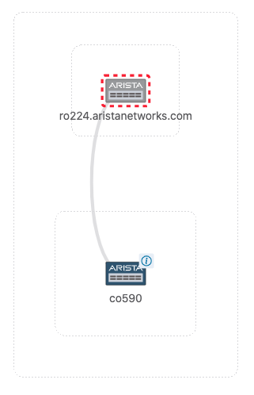
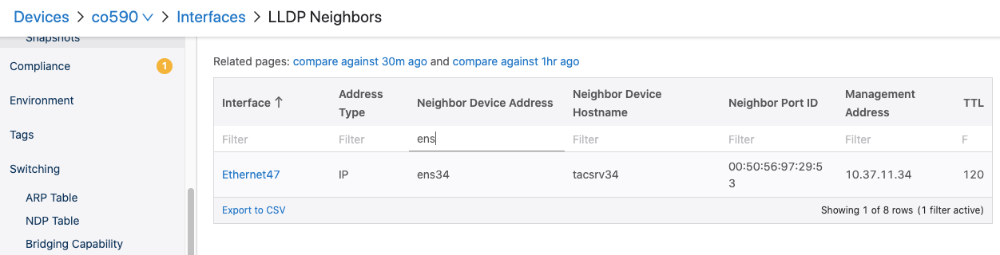
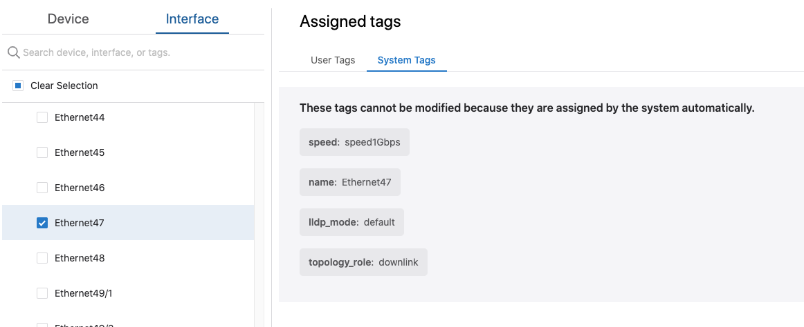
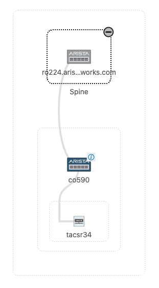
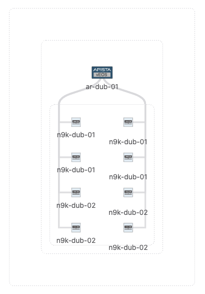
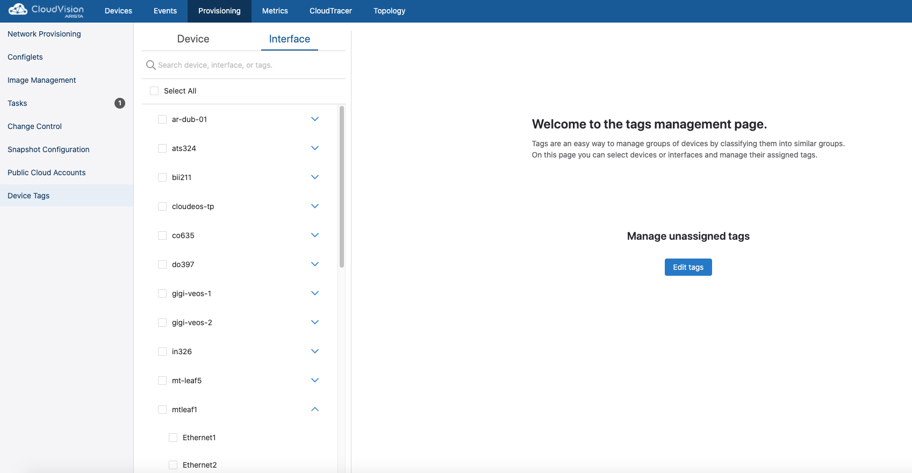
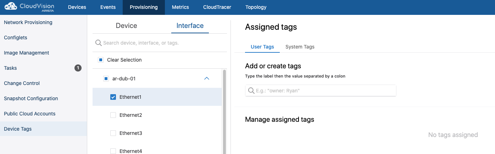
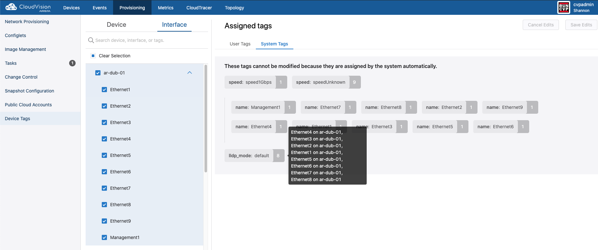
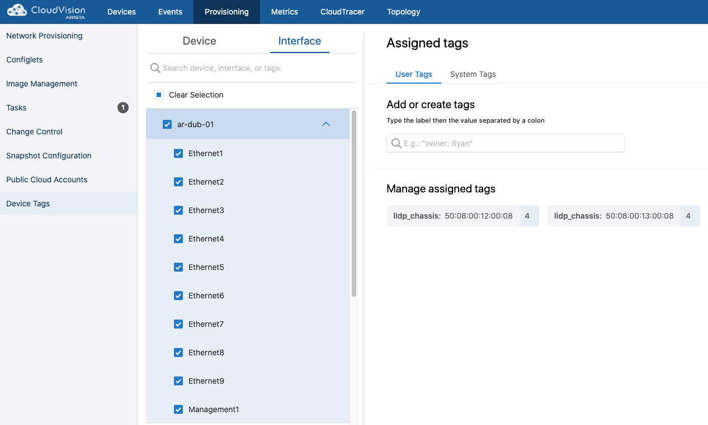
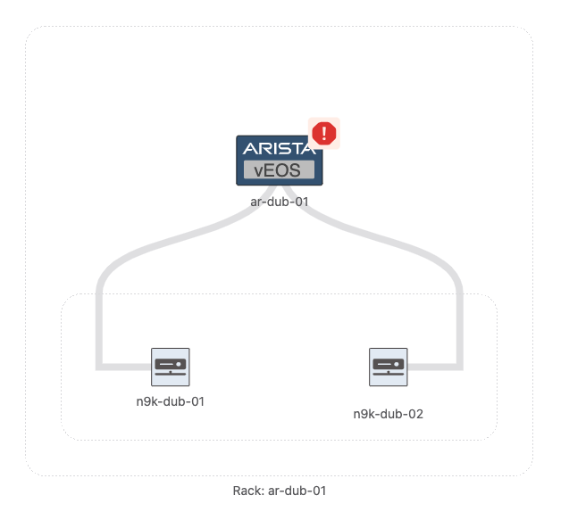

# Tag resource examples and use-cases

## gRPC ports

- 8443 up to 2021.2.2
- 443 from 2021.3.0 or newer

## Authenticating with CloudVision

### CloudVision On-Prem

On CloudVision on-prem deployments a session token can be generated either via the login endpoint (short term)
or by creating a service account token (long-term).

The [get_token.py](../../../get_token.py) script can be used to get the token and the certificate from
the CloudVision server:

`python3 get_token.py --server 192.0.2.79 --username cvpadmin --password arastra --ssl`

The two files that will be saved can then be used to authenticate:

- token.txt
- cvp.crt

To use token based authentication, the steps are the same as for CVaaS below.

### CloudVision as a Service

To access the CloudVision as-a-Service and send API requests, “Service Account Token” is needed.
After obtaining the service account token, it can be used for authentication when sending API requests.

Service accounts can be created from the Settings page where a service token can be generated as seen below:


The token should be copied and saved to a file that can later be referred to.

## Example 1) Making servers visible on Topology

As of 2020.2.0 the only supported LLDP Chassis ID TLV is subtype 4 (MAC Address). Due to this some 3rd party devices, like ESXI servers, which might advertise UUID or ifName instead of the Chassis MAC in the TLV, those devices will not be drawn on Topology, even though their LLDP states are seen in EOS. To workaround this we can tag the interfaces on the switches where these servers are connected with `lldp_chassis`, `lldp_mode` and `lldp_hostname` tags, thus forcing the values for those states.

Consider the following setup: **tacsrv34 (ens34) -- (et47) co590 --  ro224**

`co590` is receiving below LLDP information from tacsrv34:

```shell
co590...23:26:30(config)#show lldp nei et47 det
Interface Ethernet47 detected 1 LLDP neighbors:

  Neighbor "ens34"/0050.5697.2953, age 29 seconds
  Discovered 0:45:05 ago; Last changed 0:45:05 ago
  - Chassis ID type: Interface name (6)
    Chassis ID     : "ens34"
  - Port ID type: MAC address(3)
    Port ID     : 0050.5697.2953
  - Time To Live: 120 seconds
  - Port Description: "Interface   3 as ens34"
  - System Name: "tacsrv34"
  - System Description: "Linux tacsrv34 3.19.8-100.fc20.x86_64 #1 SMP Tue May 12 17:08:50 UTC 2015 x86_64"
  - System Capabilities : Station Only
    Enabled Capabilities: Station Only
  - Management Address Subtype: IPv4
    Management Address        : 10.37.11.34
    Interface Number Subtype  : ifIndex (2)
    Interface Number          : 3
    OID String                :
```

As you can see the `Chassis ID TLV` has subtype 6, which is `Interface name` and has the value of `ens34` (the interface name of the linux server).

If you check topology you'll see something like below (notice that the server is not shown):



On the Device page you'll see the server showing up in the LLDP table



### Steps

1\. Create a small database of tags, e.g. [tags.yaml](tags.yaml)

```yaml
tags:
  device_tags:
  - label: leaf1DTag1
    value: leaf1DVal1
    device_id: JPE14243257
  - label: leaf1DTag2
    value: leaf1DVal2
    device_id: JPE14243257
  interface_tags:
  - label: lldp_chassis
    value: de:ad:be:ef:ca:fe
    device_id: JPE14243257
    interface_id: Ethernet24
  - label: lldp_hostname
    value: tacsrv18
    device_id: JPE14243257
    interface_id: Ethernet24
```

`lldp_hostname` is optional

`lldp_mode` can be `default` or `forced` and it should already exist, in case they don't, they can be added to the yaml file.

2\. Create and assign the tags

Create the `lldp_chassis` tag and assign the MAC address of the server as the value:

`python3 manage_tags.py --server 192.0.2.79:443 --token-file token.txt --cert-file cvp.crt --create-and-assign`

After this you should see the user tags and system tags added on the UI:



And finally the server should show up in Topology:



## Example 2) Devices showing up multiple times in Topology

Some devices advertise the Interface MAC instead of the Chassis MAC in the LLDP Chassis ID TLV and since those are unique addresses, each link will be detected as a different device.

In the below setup, `ar-dub-01` is connected to `n9k-dub-01` and `n9k-dub-02` on 8 interfaces (4 each). Without tagging all interfaces to use one MAC for the same neighbor Topology looks like below:



### Steps

1\. To workaround this we can create the tags which will be in the format of `tag_label: tag_value`. In our case we will need two tags:

- `lldp_chassis` mapped to the chassis MAC (in my case I just used the first interface's MAC for all interfaces)
- `lldp_mode` with the value of `default`

To create and assign the tags we can use [manage_tags.py](./manage_tags.py) using the following syntax:

`python3 manage_tags.py --server {cvpIP}:443 --token-file {tokenFile} --cert-file {certFile} --file {filename} --create`

and

`python3 manage_tags.py --server {cvpIP}:443 --token-file {tokenFile} --cert-file {certFile} --file {filename} --assign`

e.g.:

`python3 manage_tags.py --server 192.0.2.79:443 --token-file token.txt --cert-file cvp.crt --file nx9k.yaml --create`

`python3 manage_tags.py --server 192.0.2.79:443 --token-file token.txt --cert-file cvp.crt --file nx9k.yaml --assign`

or it can be also done in one single command using the `--create-and-assign` flag, e.g.:

`python3 manage_tags.py --server 192.0.2.79:443 --token-file token.txt --cert-file cvp.crt --file nx9k.yaml --create-and-assign`

For the purpose of illustrating the process step by step, in this example we create the tags first and then assign them.

At this point you should see that there's an unassigned tag. Go to:

- **Provisioning**
- **Device Tags**
- click on the **Interface** tab
- click on **Edit Tags**



2\. We now have to assign the tag we created to all the interfaces for the same neighbor. Before doing that you can check if there's a tag already assigned on the interfaces. Go to:

- **Provisioning**
- **Device Tags**
- click on the **Interface** tab
- select the interfaces of the device and check the user and system tags. As you can see there's no `lldp_mode` or `lldp_chassis` tag assigned:



For assigning the tag we can use [manage_tags.py](./manage_tags.py) with the following syntax:
`python3 assign_tags.py --server {cvpIP}:443 --token-file {tokenFile} --cert-file {certFile} --file nx9k.yaml --assign`

If everything went smoothly, you should see the `lldp_chassis` tag applied on Ethernet1-4

3\. Repeat for the second box

> Note this can be done for all devices in one go, just by adding all the tags in the yaml file.

 After this you should see the tags assigned to all interfaces

 
 

4\. Checking topology you should now only see 2 neighbors:

 

## Example 3) Assign topology tags to devices

The Tag.V2 resource API can be also used to assign topology tags to devices
Possible topology tags are as below:

- topology_hint_type
  - predefined values:
    - core
    - edge
    - endpoint
    - leaf
    - management
    - spine
- topology_hint_rack
- topology_hint_pod
- topology_hint_datacenter
- topology_hint_building
- topology_hint_floor

> Note you can add other arbitrary tags to leverage it in other parts of CloudVision, e.g. event rule configuration.

The steps to build the topology would be as simple as creating the tags with the arbitrary value (except for the device type which are predefined)
and assign them to the devices:

1\. Create tag values

```shell
python3 manage_tags.py --server 192.0.2.79:443 \
  --token-file token.txt \
  --cert-file cvp.crt \
  --file topology_tags.yaml \
  --create-and-assign
```

2\. Repeat for the other devices

The following is an example of a Leaf-Spine topology:


>Note that this is just a basic example, which can be modified to receive a list of devices as input.

## CloudVision as a Service example

The only difference between sending requests to CloudVision as a Service compared to CloudVision On-Prem is that only the service token is needed and the API endpoint is at TCP 443 instead of 8443.

Creating and assigning device tags:

```shell
python3 manage_tags.py --server www.arista.io:443 --token-file cvaasToken.txt --file tags.yaml --create

python3 manage_tags.py  --server www.arista.io:443 --token-file cvaasToken.txt --file tags.yaml --assign

python3 manage_tags.py  --server www.arista.io:443 --token-file cvaasToken.txt --file tags.yaml --unassign

python3 manage_tags.py  --server www.arista.io:443 --token-file cvaasToken.txt --file tags.yaml --create-and-assign
```
